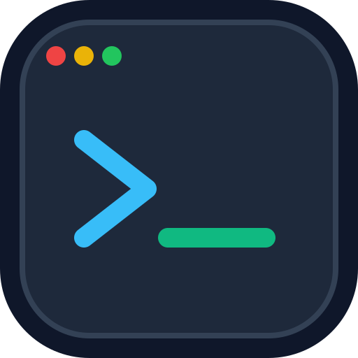

# OpenTerm (Unified SSH Terminal & Dual-Pane SFTP Client)

<p align="center">
  
</p>

<p align="center">
  A high-performance, lightweight, dual-purpose SSH terminal and dual-pane SFTP file manager built on top of <strong>Tauri 2</strong>, <strong>React 19</strong>, <strong>Tailwind CSS v4</strong>, <strong>Zustand</strong>, <strong>xterm.js</strong>, and <strong>Rust</strong>.
</p>

<p align="center">
  
  
  
  
  
</p>

---

## Highlights & Architecture

- **Ultra-Lightweight Footprint (80MB - 150MB)**: Uses native OS webviews via Tauri 2 rather than bundling heavy Chromium instances (like Termius/Electron).
- **Direct PTY Streaming**: Raw pseudo-terminal byte I/O streamed from Rust directly to `xterm.js` over Tauri event emitters, bypassing standard IPC invoke serialization bottlenecks.
- **Zero-Binary in JavaScript Rule**: SFTP file downloads and uploads transfer directly between the remote SSH socket and local disk in Rust (128 KB buffered native stream). File binaries **never** pass through JS runtime memory.
- **Chunked Directory Queries**: Traversal of remote and local folders is paginated across IPC to protect serialization buffers from large directory trees.
- **Virtualized Dual-Pane Explorer**: Powered by `@tanstack/react-virtual` to smoothly render thousands of files with minimal DOM nodes.
- **Awwwards / Linear-Tier Visual Design**: Built using the `high-end-visual-design` standard—featuring Ethereal Glass OLED aesthetics, double-bezel hardware enclosures, button-in-button trailing icons, custom Plus Jakarta Sans typography, and fluid micro-motion.

---

## Features

- [x] **Multi-session Management**: Open, reconnect, and switch between multiple remote SSH connections with live status indicators.
- [x] **Interactive Terminal Shell**: Full `xterm-256color` compatibility with auto-fit resizing, web links, and buffer preservation across reconnections.
- [x] **Dual-Pane File Manager**: Side-by-side local filesystem and remote SFTP explorer with virtualized scrolling.
- [x] **In-App Remote File Editor**: Edit remote and local config, text, or script files with syntax highlighting and direct disk-to-socket saving.
- [x] **Visual Permissions Manager (chmod)**: Inspect and edit Unix octal permissions (`0755`, `0644`) and user/group/other bit flags.
- [x] **Transfer Conflict Resolution**: Side-by-side comparison modal with 5 resolution actions (Overwrite, Overwrite Newer, Overwrite if Size Differs, Auto-Rename `(n)`, Skip) and batch application.
- [x] **Encrypted Profile Vault**: Master password security encrypting saved host credentials using PBKDF2-HMAC-SHA256 (100k rounds) and AES-256-GCM (`vault.enc`).
- [x] **Two-Factor Authentication (2FA) & App Lock**: RFC 6238 TOTP authenticator protection with 8 single-use emergency backup recovery codes and configurable idle auto-lock.
- [x] **Connection Resilience & Auto-Reconnect**: TCP keepalive probes (15s) and automatic exponential backoff reconnection worker (1s, 2s, 4s, 8s, 16s) that preserves terminal buffers and directory locations.
- [x] **SFTP Quick Search & Filter Bar (`Ctrl+F`)**: Real-time substring filter on directory contents with matching items counter.
- [x] **FileZilla-Style Drag-and-Drop Transfers**: Drag files between local and remote panes, into target folders, or directly from OS file explorer.
- [x] **Keyboard Shortcuts**:
  - `F5` / `Ctrl+R`: Refresh directory
  - `F2`: Rename file/folder
  - `Delete`: Delete file/folder
  - `Ctrl+N`: Create new file
  - `Ctrl+Shift+N`: Create new folder
  - `Ctrl+F`: Focus search & filter bar
  - `Ctrl+L` / `Alt+D`: Focus editable path bar
  - `Enter`: Open folder / edit file
  - `Backspace` / `Alt+Up`: Navigate to parent directory
- [x] **Resizable Split Views**:
  - **Terminal Full View**: Maximized command-line workflow.
  - **Dual Split View**: Draggable split between Terminal and SFTP explorer.
  - **SFTP Full View**: Fullscreen file manager experience with draggable Local vs. Remote split.

---

## Tech Stack

| Layer | Technology |
| --- | --- |
| **Core Desktop Engine** | [Tauri 2](https://v2.tauri.app/) |
| **Backend / Systems** | Rust, `ssh2-rs` (`libssh2`), `tokio`, `parking_lot` |
| **Frontend Framework** | [React 19](https://react.dev/), TypeScript, [Vite](https://vite.dev/) |
| **Styling** | [Tailwind CSS v4](https://tailwindcss.com/) (`@tailwindcss/vite`) |
| **Terminal Emulator** | [xterm.js](https://xtermjs.org/) + Fit Addon + Web Links Addon |
| **Virtualization** | [`@tanstack/react-virtual`](https://tanstack.com/virtual/latest) |
| **State Management** | [Zustand](https://github.com/pmndrs/zustand) |
| **Icons** | [Lucide React](https://lucide.dev/) |

---

## Getting Started

### Prerequisites

1. **Bun** (or Node.js 20+ / npm):
   ```bash
   curl -fsSL https://bun.sh/install | bash
   ```
2. **Rust & Cargo**:
   ```bash
   curl --proto '=https' --tlsv1.2 -sSf https://sh.rustup.rs | sh
   ```
3. **C Compiler & CMake / pkg-config** (required by `libssh2-sys`):
   - **macOS**: `xcode-select --install`
   - **Linux (Ubuntu/Debian)**: `sudo apt install build-essential pkg-config libssl-dev`

---

### Installation & Development

1. **Clone repository**:
   ```bash
   git clone https://github.com/rzkfyn/openterm.git
   cd openterm
   ```

2. **Install frontend dependencies**:
   ```bash
   bun install
   ```

3. **Run in development mode**:
   ```bash
   bun run tauri dev
   ```

---

### Testing & Quality Checks

Run frontend unit tests:
```bash
bun run test
```

Run Rust backend tests:
```bash
cd src-tauri && cargo test
```

Build production bundle:
```bash
bun run tauri build
```

---

### Reporting Issues & Feedback

Encountered a bug or have an idea to make OpenTerm better? We welcome issues and contributions!

- **[Report a Bug](https://github.com/rzkfyn/openterm/issues/new?template=bug_report.yml)**: Use this form if something is broken, crashing, or misbehaving.
- **[Request a Feature](https://github.com/rzkfyn/openterm/issues/new?template=feature_request.yml)**: Suggest improvements, new tools, or UX enhancements.
- **[GitHub Discussions](https://github.com/rzkfyn/openterm/discussions)**: Ask general questions, share configurations, and connect with other users.

> **Privacy Notice**: When reporting issues or attaching logs/screenshots, **never include private keys, credentials, or sensitive server URLs**.

---

## License

MIT License. Designed and engineered for high-efficiency remote server administration.
